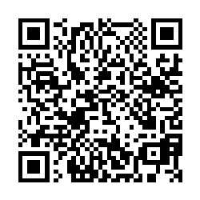

# QR code payments for Go

[](https://travis-ci.com/dundee/go-qrcode-payment)
[](https://codecov.io/gh/dundee/go-qrcode-payment)
[](https://goreportcard.com/report/github.com/dundee/go-qrcode-payment)
[](https://codeclimate.com/github/dundee/go-qrcode-payment/maintainability)
[](https://codescene.io/projects/14391)



Golang library for creating QR codes for payments.

[Short Payment Descriptor](https://en.wikipedia.org/wiki/Short_Payment_Descriptor) format is supported for now.

## Installation

    go get -u github.com/dundee/go-qrcode-payment

## Usage

### Generating QR code image

```Go
import payment "github.com/dundee/go-qrcode-payment"

p := payment.NewSpaydPayment()
p.SetIBAN("CZ5855000000001265098001")
p.SetAmount("10.8")
p.SetDate(time.Date(2021, 12, 24, 0, 0, 0, 0, time.UTC))
p.SetMessage("M")
p.SetRecipientName("go")
p.SetNofificationType('E')
p.SetNotificationValue("daniel@milde.cz")
p.SetExtendedAttribute("vs", "1234567890")

payment.SaveQRCodeImageToFile(p, "qr-payment.png")
```

QR code image encoding uses [skip2/go-qrcode](https://github.com/skip2/go-qrcode).

### Getting QR code content

```Go
import payment "github.com/dundee/go-qrcode-payment"

p := payment.NewSpaydPayment()
p.SetIBAN("CZ5855000000001265098001")
p.SetAmount("108")

fmt.Println(payment.GenerateString())
```

## TODO

* support for [EPC QR code](https://en.wikipedia.org/wiki/EPC_QR_code)